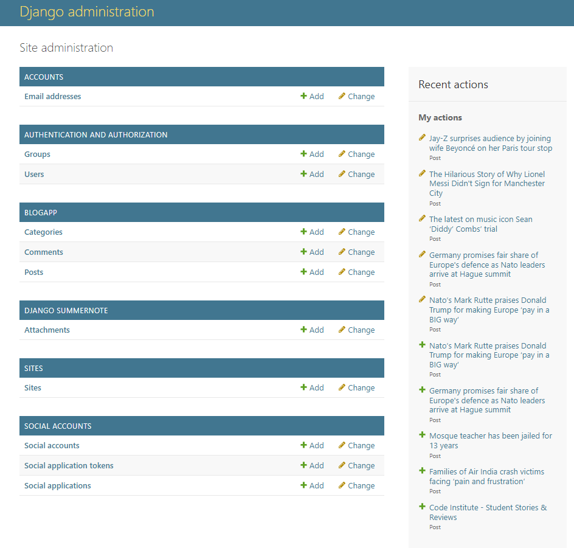
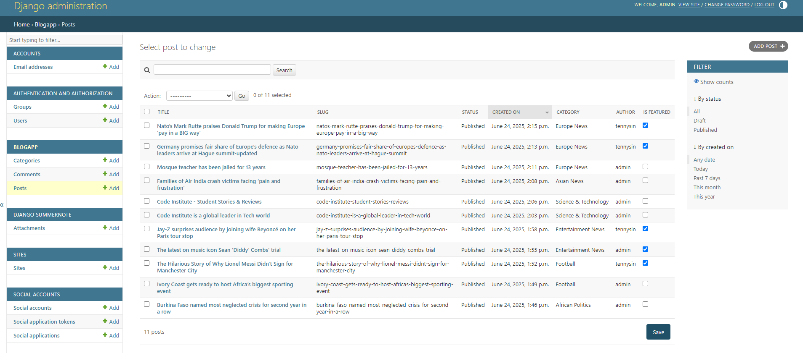

# django_iberica


Iberica News | Blog is a full stack website built using Django, Python, HTML, CSS and JavaScript. The website utilises Postgres as the database processor.

This project was created as my fourth milestone project for my Level 4 Diploma in Web Application Development with the Code Institute.

[Visit Iberica News | Blog Here](https://ibericablog-f1b21cd96563.herokuapp.com)


## User Experience

## 🧑‍💻 User Roles in *Ibérica News|Blog*

User roles are an essential part of the **Ibérica News|Blog**  platform, as they determine the range of features available to each user. The site supports two distinct roles:

## User Types

### 👤 Users

Regular users are those who have signed up and verified their accounts. They can:
- Create, publish and edit their own posts.
- Like and unlike posts
- Comment on posts
- Edit or delete their own content
- View and browse all public content.

### 🛠️ Admin

## 🛡️ Admin Features

Admins are users with **superuser** status. In addition to all the features available to regular users, they have elevated privileges that allow them to:

- ✅ Access the **Django Admin Dashboard** at `/admin/`
- ➕ Add, edit, and delete blog **categories**
- 📝 Moderate and manage **all posts** and **comments**
- 👥 Oversee and manage all **user activity**
- 📂 View and control all **user-generated content**
- 🧱 Maintain the **structure** and **integrity** of the site

These features are essential for curating content, maintaining quality, and ensuring that the platform runs smoothly.

### 🔧 Admin Dashboard Views

| Category Management | Post Moderation | User Overview |
|---------------------|------------------|----------------|
|  |  |  |

---

## 🔐 Role Management with Django

Roles are managed using Django’s built-in authentication and permissions system.

### Creating Admins

Admins are simply users with `is_superuser=True` and `is_staff=True`. You can create an admin via the CLI:

```bash
python manage.py createsuperuser

```bash
python manage.py createsuperuser
```

## ✅ Role Permissions Summary

| Role   | Can Post | Can Comment | Can Like | Add Categories | Access Admin Panel |
|--------|----------|-------------|----------|----------------|---------------------|
| User   | ✅       | ✅          | ✅       | ❌             | ❌                  |
| Admin  | ✅       | ✅          | ✅       | ✅             | ✅                  |


## 🚀 Features - Home Page

* Navbar - The navbar on the site is split into two sections, the first section contains the clickable Logo as the home page, search, Login and Register.  The second section contains the sites blog categories. The navbar is fully responsive. After user login, the Login becomes Add Post and Register becomes Logout.

The Categories links in the navbar have a transition that moves the category name up when hovered over to give the user feedback that they are selecting that category.

- **Blog Categories**: Dynamically loaded from the database and allow category-based filtering of blog posts.

Navbar behavior changes based on the user's login state.

---

## 🔁 User Navigation Logic

| User State    | Link: Left Section       | Link: Right Section |
|---------------|--------------------------|----------------------|
| Anonymous     | Logo, Search, Login, Register | Blog Categories     |
| Authenticated | Logo, Search, Add Post, Logout | Blog Categories     |


### Register Page

* The **Register** page allows users to create an account using the following fields:

- Username
- Email
- Password (with confirmation)
- User Registration and Authentication
- Dynamic Blog Categories
- Post Creation (for logged-in users)
- Responsive Navigation Bar
- Search Functionality
- Secure Login/Logout
- Bootstrap 

Upon successful registration, users are redirected to the login page to access member-only features like posting and commenting.


---

* Login Page - The login page will allow users to sign into their account with either their username.

### Sign in Page

- The sign in page provides inputs for a user to enter their username together with their password along with three buttons, a back button, a sign in button and a forgot password button. A message at the top of the page provides a link to users if they don't currently have an account which directs them to the signup page. Successful sign in will see a flash 3 seconds message as Successfully signed in as "Your username".


* Logout Page - The logout page will allow registered users to sign out of their account.

### Sign out page

- The logout page will ask the user two options to confirm they wish to SignOut or cancel. If the user clicks the SignOut button they will be logged out of their account, then a 3 seconds flash message "You have signed out" and redirected to the home page.

When a user selects the sign out link from the account dropdown, they will be asked to confirm that they wish to sign out of their account. The user can either select the cancel button which will redirect them to the home page, or they can confirm they wish to sign out by clicking the sign out button. The user will be redirected to the home page signed out of their account and shown a success toast letting them know they were successfully signed out.


* 404 Error - The 404 page lets the user know there has been a problem and displays a button to redirect them to the home page.

  


## POSTS

The home page contains posts that are clickable and comprises of two posts categories as follows:-

* FEATURED POSTS
These contains post that have been published and then tagged featured by the admin only to randomly appear in the special space created. Registered users does not have the accessibility to feature any post.


* RECENT POSTS: These are recent posts that have been added by the users (registered users and admin)  


* Footer - The footer contains clickable social media links. 


## 🔍 Search Functionality

Users can search blog content directly from the navigation bar. Results are displayed on a dedicated Search Results page.

- Input is matched against **post titles** and **content**
- Matching posts are displayed with title, short preview, and "Read More" links
- If no results match, a message is shown
- Fully responsive and styled using Bootstrap


### Accessibility

I have been mindful during coding to ensure that the website is as accessible friendly as possible. This has been have achieved by:

* Using semantic HTML.
* Using descriptive alt attributes on images on the site.
* Providing information for screen readers where there are icons used and no text.
* Ensuring that there is a sufficient colour contrast throughout the site. (update on colours chosen explained in the colour scheme section.)

Accessibility was tested using Lighthouse and WAVE and further information can be found in the [TESTING.md](TESTING.md)

---

## Technologies Used

### Languages Used

HTML, CSS, JavaScript, Python

### Database Used

Postgres


### Frameworks Used

[Django](https://www.djangoproject.com/) - A high-level Python web framework that encourages rapid development and clean, pragmatic design.

[Bootstrap](https://getbootstrap.com/docs/4.6/getting-started/introduction/) - Version 4.6.2 - A framework for building responsive, mobile-first sites.

### Libraries & Packages Used

[Font Awesome](https://fontawesome.com/) - Version 6.2.1 - Used for the iconography of the site, this was added using a CDN link.

[Django Allauth](https://django-allauth.readthedocs.io/en/latest/) - Version 0.41.0 - Used for authentication, registration & account management.

[django-countries](https://pypi.org/project/django-countries/7.2.1/) - Version 7.2.1 - This is the latest stable version that is compatible with GitPod.

[django_crispy_forms](https://pypi.org/project/django-crispy-forms/) - provides a tag and filter that lets you quickly render forms

[gunicorn](https://pypi.org/project/gunicorn/) - a Python WSGI HTTP Server

[pillow](https://pypi.org/project/Pillow/) - Python imaging library

[dj_databsae_url](https://pypi.org/project/dj-database-url/) - allows us to utilise the DATABASE_URL variable

[psycopg2](https://pypi.org/project/psycopg2/) - a postgres database adapter which allow us to connect with a postgres database

[django-storages](https://pypi.org/project/django-storages/) - a storage backend library


### Programs Used

[Am I Responsive](https://ui.dev/amiresponsive) - To create the responsive images of the site on a variety of device sizes.
[Favicon.io](https://favicon.io/) - To create the favicon.
[Git](https://git-scm.com/) - For version control.
[GitHub](https://github.com/) - To save and store the files for this project.
[Google Dev Tools](https://developer.chrome.com/docs/devtools/) - To troubleshoot, test features and solve issues with responsiveness and styling.
[Pip](https://pypi.org/project/pip/) - A tool for installing Python packages.


## Deployment & Local Development

### Deployment

The project is deployed using Heroku. To deploy the project:

#### **Heroku app setup**

  1. From the [Heroku dashboard](https://dashboard.heroku.com/), click the new button in the top right corner and select create new app.
  2. Give your app a name (this must be unique), select the region that is closest to you and then click the create app button bottom left.
  3. Open the settings tab and create a new config var of `DATABASE_URL` and paste the database URL you copied from elephantSQL into the value (the value should not have quotation marks around it).

#### **Preparation for deployment in VSCODE**

1. Install dj_database_url and psycopg2 (they are both needed for connecting to the external database you've just set up):

   ```bash
   pip3 install dj_database_url==0.5.0 psycopg2
   ```

2. Update your requirements.txt file with the packages just installed:

    ```bash
    pip3 freeze > requirements.txt
    ```

3. In settings.py underneath import os, add `import dj_database_url`

4. Find the section for DATABASES and comment out the code. Add the following code below the commented out database block, and use the URL copied from elephantSQL for the value:

    (NOTE! don't delete the original section, as this is a temporary step whilst we connect the external database. Make sure you don't push this value to GitHub - this value should not be saved to GitHub, it will be added to the Heroku config vars in a later step, this is temporary to allow us to migrate our models to the external database)

    ```python
    DATABASES = {
        'default': dj_database_url.parse('paste-elephantsql-db-url-here')
    }
    ```

5. In the terminal, run the show migrations command to confirm connection to the external database:

    ```bash
    python3 manage.py runserver
    ```

6. If you have connected the database correctly you will see a list of migrations that are unchecked. You can now run migrations to migrate the models to the new database:

    ```bash
    python3 manage.py migrate
    ```

7. Create a superuser for the new database. Input a username, email and password when directed.

    ```bash
    python3 manage.py createsuperuser
    ```

8. You should now be able to go to the browser tab on the left of the page in elephantsql, click the table queries button and see the user you've just created by selecting the auth_user table.
9. We can now add an if/else statement for the databases in settings.py, so we use the development database while in development (the code we commented out) - and the external database on the live site (note the change where the db URL was is now a variable we will use in Heroku):

    ```PostgreSQL database

DATABASES = {
    'default': dj_database_url.parse(os.environ.get("DATABASE_URL"))
 }

    ```

10. Install gunicorn which will act as our webserver and freeze this to the requirements.txt file:

    ```bash
    pip3 install gunicorn
    pip3 freeze --local > requirements.txt
    ```

11. Create a `Procfile` in the root directory. This tells Heroku to create a web dyno which runs gunicorn and serves our django app. Add the following to the file (making sure not to leave any blank lines underneath):

    ```Procfile
    web: gunicorn seaside_sewing.wsgi:application
    ```

12. Log into the Heroku CLI in the terminal and then run the following command to disable collectstatic. This command tells Heroku not to collect static files when we deploy:

    ```bash
    heroku config:set DISABLE_COLLECTSTATIC=1 --app heroku-app-name-here
    ```

13. We will also need to add the Heroku app and localhost (which will allow GitPod to still work) to ALLOWED_HOSTS = [] in settings.py:

    ```python
    ALLOWED_HOSTS = ['{heroku deployed site URL here}', 'localhost' ]
    ```

14. Save, add, commit and push the changes to GitHub. You can then also initialize the Heroku git remote in the terminal and push to Heroku with:

    ```bash
    heroku git:remote -a {app name here}
    git push heroku master
    ```

15. You should now be able to see the deployed site (without any static files as we haven't set these up yet).

16. To enable automatic deploys on Heroku, go to the deploy tab and click the connect to GitHub button in the deployment method section. Search for the projects repository and then click connect. Click enable automatic deploys at the bottom of the page.

#### **Generate a SECRET KEY & Updating Debug**

1. Django automatically sets a secret key when you create your project, however we shouldn't use this default key in our deployed version, as it leaves our site vulnerable. We can use a random key generator to create a new SECRET_KEY which we can then add to our Heroku config vars which will then keep the key protected.
2. [Django Secret Key Generator](https://miniwebtool.com/django-secret-key-generator/) is an example of a site we could use to create our secret key. Create a new key and copy the value.
3. In Heroku settings create a new config var with a key of `SECRET_KEY`. The value will be the secret key we just created. Click add.
4. In settings.py we can now update the `SECRET_KEY` variable, asking it to get the secret key from the environment, or use an empty string in development:

    ```python
    SECRET_KEY = os.environ.get('SECRET_KEY', ' ')
    ```

5. We can now adjust the `DEBUG` variable to only set DEBUG as true if in development:

    ```python
    DEBUG = 'DEVELOPMENT' in os.environ
    ```

6. Save, add, commit and push these changes.


### Local Development

#### **How to Fork**

To fork the repository:

1. Log in (or sign up) to GitHub.
2. Go to the repository for this project, [Iberica News|Blog](https://github.com/Obasohan2/django_iberica).
3. Click on the fork button in the top right of the page.

#### **How to Clone**

To clone the repository:

1. Log in (or sign up) to GitHub.
2. Go to the repository for this project, [Iberica News|Blog](https://github.com/Obasohan2/django_iberica).
3. Click the Code button, select whether you would like to clone with HTTPS, SSH or the GitHub CLI and copy the link given.
4. Open the terminal in your chosen IDE and change the current working directory to the location you would like to use for the cloned repository.
5. Type the following command into the terminal `git clone` followed by the link you copied in step 3.
6. Set up a virtual environment (this step is not required if you are using the Code Institute template and have opened the repository in GitPod as this will have been set up for you).
7. Install the packages from the requirements.txt file by running the following command in the terminal:

```bash
pip3 freeze --local > requirements.txt
```

---

## Testing

Please refer to the [TESTING.md](TESTING.md) file for all testing performed.

---

## Credits

### Code Used

This project was created using methods taught in the Code Institutes walkthrough project 

- I used various youtube tutorials to find more options as to solution when i am stocked.
- I  researched on (https://www.w3schools.com) [W3SCHOOLS] on bootstrap responsive and semantics and applied the knowledge.
- I  researched on this (https://developer.mozilla.org") [MDN] to learn more on html and CSS semantics 
- I used code aquired from (https://codeinstitute.net") [Code Institute] to for my webpage.


### Content

Content for the site was written by Dreams Clement Obasohan.


### Acknowledgments

I would like to acknowledge the following people who have helped me with this project:
* My Code Institute mentor - Mr. Jubril Akolade
* The Code Institute Student Care for their support and encouragements.