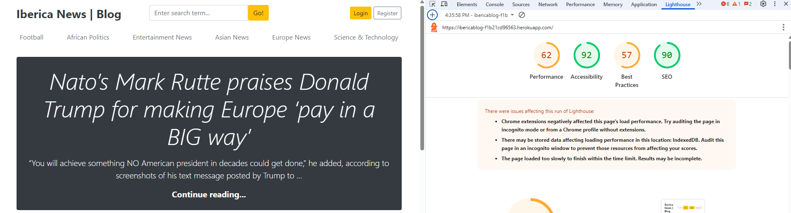

# django_iberica

---

## TESTING.md

### Overview

This document outlines the testing procedures for the **Iberica News|Blog** Django project, including manual testing of UI features, Django backend testing, and user story validation.

---

## Manual Testing

### User Authentication

| Feature                 | Test Scenario                                      | Expected Outcome                          | Pass/Fail |
|------------------------|----------------------------------------------------|-------------------------------------------|-----------|
| Register               | New user signs up with valid data                 | Account is created and redirected to login | Pass |
| Login                  | Valid credentials                                 | Redirect to homepage, Add Post and Logout shown | Pass |
| Login                  | Invalid credentials                               | Displays error message                     | Pass |
| Logout                 | Click Logout link                                 | User is logged out, Login/Register shown   | Pass |

---

### Post Management

| Feature     | Test Scenario                                 | Expected Outcome                        | Pass/Fail |
|------------|------------------------------------------------|-----------------------------------------|-----------|
| Add Post   | Authenticated user submits valid form          | Post appears on home page               | Pass  |
| Edit Post  | User edits their own post                      | Updates saved and reflected in UI       | Pass  |
| Delete Post| User deletes their own post                    | Post no longer exists                   | Pass  |
| Permissions| Non-owner tries to edit/delete post            | Access denied or redirected             | Pass  |

---

### Categories & Navigation

| Feature      | Test Scenario                        | Expected Outcome                        | Pass/Fail |
|-------------|---------------------------------------|-----------------------------------------|-----------|
| Categories   | Click on a category in navbar         | Posts filtered by selected category     | Pass  |
| Responsive   | Resize browser or test mobile view    | Navbar adapts, dropdown toggles work    | Pass  |

---

### Search Functionality

| Feature | Test Scenario                    | Expected Outcome                                 | Pass/Fail |
|--------|-----------------------------------|--------------------------------------------------|-----------|
| Search | Enter a keyword in navbar search  | Results page shows matching post titles/content  | Pass |
| Search | Enter gibberish                   | Message displays "no results found"              | Pass  |

---

### Admin Dashboard

| Feature       | Test Scenario                                  | Expected Outcome                       | Pass/Fail |
|---------------|-------------------------------------------------|----------------------------------------|-----------|
| Admin Access  | Superuser logs in at /admin/                    | Access to Django admin dashboard       | Pass      |
| Category CRUD | Admin adds/edits/deletes categories             | Changes reflected in navbar            | Pass      |
| Content Mod   | Admin edits or deletes any post/comment         | Changes appear immediately             | Pass      |

---

## 👥 User Story Testing

| User Story                                                                 | Tested? |
|----------------------------------------------------------------------------|---------|
| As a visitor, I can register and log in to post blogs                     | Pass     |
| As a user, I can create, update, and delete my own blog posts            | Pass      |
| As a visitor, I can view blog posts by category or search term           | Pass      |
| As an admin, I can manage users and content via the Django admin panel   | Pass      |

---

## 📱 Responsive Design Testing

Tested using:

-  Google Chrome Developer Tools (mobile/tablet/desktop breakpoints)
-  Safari and Firefox browsers
-  iPhone 14 and Android (Samsung Galaxy S23) physical devices

## Validation Testing

### HTML

[W3C](https://validator.w3.org/) was used to validate the HTML on all pages of the site. It was also used to validate the CSS. As the site is created with Django and utilises Django templating language within the HTML, I have checked the HTML by inspecting the page source and then running this through the validator.

| Page | Test Outcome | Logs|
| :--- | :--- | :---: |
| Home Page | Pass| No failure but warning |
| 404 Error Page | Pass | No failure but warning |
| Registered user Page | Pass | No failure but warning|
| Edit Product Page | Pass | No failure but warning |

### CSS

[W3C](https://validator.w3.org/) was used to validate the CSS.

| File | Test Outcome | Logs |
| :--- | :--- | :---: |
| static/base.css | Pass | No failure and No warning |

### JavaScript

[JS Hint](https://jshint.com/) was used to validate the JavaScript.

| File | Test Outcome | Logs |
| :--- | :--- | :---: |
| static/js/script.js | Pass | No failure |

## Lighthouse

I have used Googles Lighthouse testing to test the performance, accessibility, best practices and SEO of the site.

#### Desktop Results
**Iberica News|Blog**

#### Mobile Results
**Iberica News|Blog**

---

## Known Issues

| Issue                              | Notes                                 |
|-----------------------------------|---------------------------------------|
| Search does not highlight keyword | Enhancement for future version        |

---

### Known Bugs

| No | Bug | Evidence |
|:--- | :--- | :---: |

## Final Notes

All core functionality has been tested manually and with unit tests. Project is stable, responsive, and secure based on current requirements.
